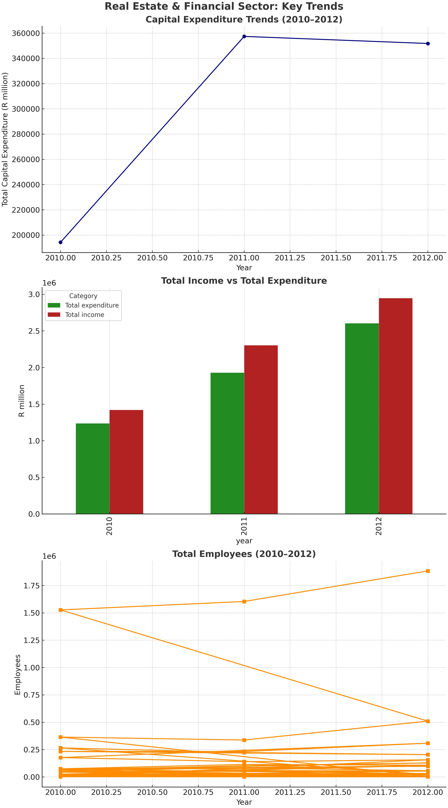

# Real Estate & Financial Sector Analysis (South Africa, 2010–2012)

<!-- Profile Header -->

  

<h1 align="center">⚡ Goitseone Ndlovu — Data Analyst | BI Developer</h1>

  Passionate about turning raw data into actionable insights.  
  Skilled in Excel, Power BI, Tableau, SQL, and Python — focused on the South African market.

  
  
  

---

  

---

## Project Overview

This project explores real-world economic data from South Africa's real estate, finance, and business services industries between 2010 and 2012. Using SQL as the main analysis tool, it uncovers trends in capital expenditure, financial health, and employment metrics. The data was cleaned, structured, queried, and visualized to present a professional data story.

---

## Contents

### 1. Cleaned Dataset (SQL)
Structured as an SQLite database (`real_estate_data.db`) for efficient query-based analysis.  
**Table Name:** `finance_data`  
**Key Columns:**  
- `code`  
- `category`  
- `year`  
- `value`

### 2. Report

A full 4-page report built in HTML and exported to PDF. It includes:
- Executive Summary  
- Methodology  
- Capital, Income, and Employment Analysis  
- Visual Overview  
- Key Insights and Takeaways  

You can [view the full report here](report.pdf) or embed it into your portfolio using HTML rendering.

### 3. Visualizations

A composite image containing:
- Capital expenditure trends  
- Total income vs expenditure  
- Total employee growth

**Image preview:**

---

